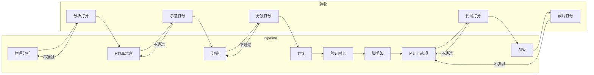

# 高中物理试题转讲解视频：详细设计

本文档约定技术栈、高中物理领域特点、编排与多模态能力、SVG 范式、知识库与 RAG、验收评估团队及各步打分标准。**不直接规划代码实现**，仅做设计约束与规范，供后续实现与 Cursor Automations 职责配置使用。

---

## 一、技术栈

### 1.1 编排与推理

| 层级 | 选型 | 职责 |
| -- | -- | -- |
| **Pipeline 编排** | **LangGraph** | 将「物理分析 → 示意 → 分镜 → TTS → 验证 → 脚手架 → Manim → 渲染」建模为状态图；支持条件分支、人工审核节点、重试与回退；每步输入/输出结构化，便于验收与打分。 |
| **业务 API** | FastAPI | 试题提交、任务状态、视频下发；与 LangGraph  Worker 解耦，通过队列或内部调用触发 pipeline。 |
| **任务队列** | Celery + Redis / RQ | 异步执行 LangGraph 流程；支持进度回调、超时与重试。 |

### 1.2 大模型与多模态

| 能力 | 要求 | 说明 |
| -- | -- | -- |
| **多模态输入** | **必须** | 试题以图片为主（试卷截图、手写题），需支持图像 + 文本联合理解；识别题目文字、公式、示意图、电路图、受力图等。 |
| **多模态模型** | 具备视觉的 LLM | 如 GPT-4o、Claude 3.5、Gemini、国产多模态等；选型时需评估：公式识别、简单电路/受力图理解、中文物理术语。 |
| **文本生成** | 步骤 1–3、6–7 | 物理分析、分镜读白、Manim 代码等以文本为主；可复用同一多模态模型或拆分为「视觉理解」+「文本生成」两阶段。 |

**设计原则**：步骤 1（物理分析）的输入必须包含「题目图像」或「图像 + OCR 文本」；步骤 2（SVG 示意）的生成应基于步骤 1 的结构化输出 + 图像，以保证示意图与题目一致并具备可控性。

### 1.3 知识库与检索

| 组件 | 选型 | 职责 |
| -- | -- | -- |
| **向量库** | 按规模选型 | 小规模：Chroma / FAISS；中大规模：Milvus / Qdrant / pgvector。存储讲义、课标、公式集等 chunk 的向量。 |
| **嵌入模型** | 中文友好 | 如 bge-large-zh、m3e 等；若需公式检索可考虑多模态嵌入或公式专用表示。 |
| **RAG 框架** | LangChain / LlamaIndex / 自研 | 负责 chunk 切分、检索、重排序、注入 prompt；与 LangGraph 节点对接，在「物理分析」「分镜读白」等节点中按需调用 RAG。 |

### 1.4 其他

* **TTS**：edge-tts 或等价；与 tutor 一致。
* **Manim**：物理场景脚手架（PhysicsScene、calculate_physics、assert_physics）；渲染脚本与 tutor 对齐。
* **存储**：任务与元数据用关系库；讲义与生成物（分析、分镜、视频）用对象存储或文件系统，并留出与向量库的同步策略。

---

## 二、高中物理领域特点

### 2.1 知识结构

* **模块**：力学（运动学、牛顿定律、能量、动量）、电磁学（电场、电路、磁场、电磁感应）、热学、光学、原子物理等；高中以力学与电磁学为主。
* **表达形式**：公式（含下标、矢量、单位）、示意图（受力图、电路图、光路图、运动轨迹）、数据表与图像（v-t、F-x 等）。
* **题型**：选择、填空、计算、实验题；部分题含多问、多图，需在分析阶段明确「问什么」「用哪张图」。

### 2.2 对 Pipeline 的约束

| 步骤 | 高中物理侧重点 |
| -- | -- |
| **1 物理分析** | 明确考查点（如牛顿第二定律、闭合电路欧姆定律）；列出已知量/未知量及单位；写出核心公式与方程；标注示意图要素（物体、力矢量、电流方向、元件）。 |
| **2 示意图** | 受力图遵循「作用点、方向、标度」；电路图符合国标符号与连接关系；运动轨迹与坐标系一致；避免与题目原图矛盾。 |
| **3 分镜与读白** | 用语符合高中课标与教材表述；先现象再公式再结论；关键公式与单位读出来或字幕呈现。 |
| **6–7 Manim** | 矢量动画方向与大小可配置；电路可抽象为符号动画；公式展示与「无 LaTeX」或 MathTex 策略一致。 |

### 2.3 可控性要求

* **分析输出**：结构化（如 JSON/Markdown 模板），便于步骤 2、3 消费；必含「示意图要素列表」与「公式列表」。
* **示意图**：不依赖模型自由绘图，而是基于「要素列表」+ **SVG 构建范式**（见下节）生成或组装，减少幻觉与不一致。
* **分镜**：幕与音频清单与 tutor 一致；读白可引用知识库中的表述习惯，由 RAG 提供参考。

---

## 三、LangGraph 编排设计

### 3.1 状态图概览

* **节点**：每步对应一个 LangGraph 节点；输入为上游状态，输出写入共享状态（如 `state.analysis`、`state.storyboard_md`）。
* **边**：默认顺序边；可插入 **验收节点**（见第五节），不通过时通过条件边回到对应生成节点重试或转人工。
* **人工审核**：可在 E1–E3、E7–E8 后增加「人工复核」节点；通过后再进入下一步，便于冷启动与质量兜底。

### 3.2 状态 schema（建议）

* `input`: 题目图片 URL/路径、可选 OCR 文本、题目 ID。
* `analysis`: 步骤 1 输出（physics_analysis.md 或等价的 JSON）。
* `html_path`: 步骤 2 输出文件路径。
* `storyboard_md`: 步骤 3 分镜全文。
* `audio_info`: 步骤 4–5 的 audio_info.json。
* `script_path`: 步骤 7 的 script.py 路径。
* `video_path`: 步骤 8 输出视频路径。
* `scores`: 各步得分与评语（见第五节）。
* `errors`: 当前步错误信息，供重试或人工处理。
* `retry_count`: 各步当前重试次数（用于准入判断与超限转异常）。

### 3.3 准入、准出与严格管控

* **准入**：每一步（含验收节点）的输入必须满足 state schema；LangGraph 条件边仅在「上一步已写入且验收通过」时进入下一步。例如：步骤 2 仅在 `state.analysis` 存在且步骤 1 验收节点已写入「通过」时执行。
* **准出**：每步输出写入 state 后必须经过**本步验收节点**；验收不通过则只写入 `state.errors` 与 `state.scores[step]`，**不写入下一步所需字段**（如步骤 1 不通过则不写 `state.analysis` 的最终版或标记为未通过），条件边回到本步重试或转人工，下一步不会被触发。
* **重试上限**：每步可配置最大重试次数（建议 2）；`state.retry_count[step]` 超限后不再重试，强制转人工或进入异常队列。
* **异常队列**：超限或人工放弃的任务进入异常队列（持久化 task_id + 失败步骤 + errors），便于人工处理或后续由思维发散 Agent 归纳为系统级改进需求；不占用正常 pipeline 的 state。

---

## 四、SVG 构建范式与可控性

### 4.1 设计目标

* **可控**：示意图由「数据驱动」生成，而非纯自然语言生成任意 SVG；减少模型幻觉与物理错误。
* **可复现**：同一「示意图要素描述」多次生成结果一致或仅允许样式差异。
* **可校验**：能对 SVG 做简单校验（如受力图力个数与方向、电路节点连通性）。

### 4.2 范式一：要素 + 模板

* **步骤 1 产出**：包含「示意图要素」结构化描述，例如：
  * 受力图：`{物体: 木块, 力: [{名: 重力, 大小: "G", 方向: 竖直向下}, {名: 支持力, 大小: "N", 方向: 竖直向上}]}`。
  * 电路图：`{元件: [{类型: 电阻, 标号: R1, 阻值: "10Ω"}, ...], 连接: [(R1, 电源正), ...]}`。
* **步骤 2**：不直接让模型输出完整 SVG，而是由**模板引擎**或**规则+代码**根据要素生成 SVG（如 Python + svgwrite、Jinja2 模板）；模型仅负责「从题目与分析中抽取要素」或「对要素做补全与修正」。
* **可控性**：模板限定图形种类（受力图、简单电路、运动轨迹）；要素即接口，便于验收与打分（要素是否与题目一致、是否缺力/多力等）。

### 4.3 范式二：分层 SVG 约定

* **图层**：背景/坐标 → 主体图形（物体、元件、轨迹）→ 标注（矢量、符号、单位）→ 图例。
* **命名与 ID**：元素带语义 ID（如 `force-G`, `resistor-R1`），便于步骤 7（Manim）引用与动画绑定。
* **单位与比例**：在 SVG 或配套 JSON 中约定「1 单位长度 = 多少物理量」，便于后续动画与公式一致。

### 4.4 范式三：符号与图元库

* **图元库**：维护「高中物理常用图元」的 SVG 片段或参数化描述（如电阻、电源、箭头、质点、斜面）。
* **步骤 2**：组合图元 + 布局算法（如力从作用点出发、电路从左到右）；模型输出「用哪些图元、放在哪、参数是什么」，由代码生成最终 SVG。
* **扩展**：新增题型时扩展图元库与模板，而非依赖模型「画整张图」。

### 4.5 验收与可控性

* 验收节点可检查：要素是否与步骤 1 一致、必选要素是否齐全、SVG 是否可解析、图元是否来自图元库等；不通过则回退到步骤 1 或 2 并写入 `state.errors`。

---

## 五、知识库与 RAG

### 5.1 知识库内容：讲义与参考资料

* **讲义**：高中物理按模块/章节整理的讲解稿、板书要点、典型例题解析（可来自教材、教辅、公开课讲义）。
* **课标与考纲**：知识点列表、能力要求、常见考查形式；用于步骤 1 的「考查点」标注与步骤 3 的表述规范。
* **公式与单位**：常用公式、单位制、符号约定；用于分析输出与分镜的公式引用、单位一致性检查。
* **分镜与读白范例**：高质量历史分镜或讲解文案；用于 RAG 检索「类似题型的讲法」，提升读白风格一致性。

**搜集与入库**：

* 来源：公开教材、教辅 PDF/HTML、校内讲义（需版权与脱敏）；按章节/模块切分为 chunk（如按节、按知识点）。
* 元数据：模块、章节、题型、是否含公式/图；便于过滤检索（如只查「力学-牛顿定律」）。
* 更新策略：新讲义入库后重算向量并写入向量库；支持按需全量重建索引。

### 5.2 RAG 使用策略

| 步骤 | 是否用 RAG | 检索内容 | 用法 |
| -- | -- | -- | -- |
| **1 物理分析** | 建议 | 课标/考纲、公式集、同模块讲义 | 辅助确定考查点、公式选择与单位；prompt 中注入「相关知识点」与「常用公式」。 |
| **2 示意图** | 可选 | 同题型示意图范例、图元说明 | 提供画图顺序与标注习惯；若采用「要素+模板」则 RAG 主要辅助要素抽取的 prompt。 |
| **3 分镜/读白** | 建议 | 讲义讲解段落、历史分镜读白 | 检索类似题型的讲法，作为「表述参考」注入；控制读白长度与结构（先现象后公式）。 |
| **6–7 脚手架/代码** | 可选 | Manim 范例、物理场景代码片段 | 减少代码幻觉、统一风格。 |

* **检索参数**：top-k、重排序、最大 token 预算；需在设计中约定默认值，并在验收中观察「检索是否带来质量提升」。
* **不写入设计文档的密钥**：API Key、向量库连接串等仅通过配置与环境变量管理。

### 5.3 评估 RAG 效果

* 可在验收中增加「引用正确性」：步骤 1/3 若引用了知识库，标注来源 chunk；人工抽检或自动检查「引用与题目模块是否匹配」。
* 若某步得分与「是否启用 RAG」做 A/B 对比，便于迭代检索策略与 chunk 质量。

---

## 六、验收评估团队与每一步打分

### 6.1 验收评估的定位

* **目的**：对 pipeline 每一步的输出做质量评估，决定是否进入下一步、是否重试或转人工。
* **主体**：可以是**自动评分器**（规则 + 模型）、**人工抽检**、或**混合**（自动打分 + 低于阈值时人工复核）。
* **产出**：每步得分（及子维度分）、评语、通过/不通过；写入 `state.scores` 与 `state.errors`，供 LangGraph 条件边使用。

### 6.2 各步验收与打分职责

| 步骤 | 验收对象 | 主要维度（见下节） | 通过条件（示例） |
| -- | -- | -- | -- |
| 1 物理分析 | physics_analysis.md / JSON | 考查点、公式与单位、要素列表、逻辑 | 考查点正确、公式无错误、要素与题目一致、得分 ≥ 阈值 |
| 2 示意图 | HTML+SVG 文件 | 与分析一致、图元规范、可解析性 | 要素齐全、无多力/少力、SVG 合法、得分 ≥ 阈值 |
| 3 分镜 | 分镜.md | 讲解文案、幕结构、音画可执行性 | 读白符合评分标准、幕与音频清单完整、得分 ≥ 阈值 |
| 7 Manim 代码 | script.py | 结构、物理正确性、音画同步 | check 通过、含 add_sound、得分 ≥ 阈值 |
| 8 成片 | 视频文件 | 画面、音质、内容正确性 | 无静音幕、字幕与读白一致、得分 ≥ 阈值 |

步骤 4–5（TTS、验证时长）以脚本执行成功与文件存在性为主，可不单独设多维度打分，仅「通过/失败」。

### 6.3 验收团队组成（建议）

* **自动评分**：规则（如公式正则、要素个数）+ 轻量模型（如对「读白」做流畅度/物理正确性打分）；运行在 LangGraph 验收节点中。
* **人工抽检**：按比例或按「自动分低于阈值」触发；由教研或标注员对分析/分镜/成片打分并写评语，结果可回写为标注数据，用于微调或规则迭代。
* **职责边界**：设计阶段只约定「谁在何时对何物打分、通过条件」；具体人力与排期由运营侧定。

### 6.4 严格管控原则

* **验收不通过则不允许进入下一步**：验收节点输出「不通过」时，不更新下一步所依赖的 state 字段（或显式标记为未通过）；条件边只允许「通过 → 下一步」或「不通过 → 本步重试/转人工」。实现时禁止跳过验收或绕过准出规则。

---

## 七、打分标准

### 7.1 通用约定

* **分数形式**：每步总分 0–100，可再拆子维度（如「正确性 40 + 完整性 30 + 规范 30」）；或采用 1–5 档 + 映射到通过阈值。
* **阈值**：低于阈值视为不通过，触发重试或人工；阈值在配置中可调，不写死在设计文档中。
* **评语**：必含「扣分原因」或「改进建议」，便于自动重试时注入 prompt 或人工修改。

### 7.2 步骤 1：物理分析

| 维度 | 权重建议 | 标准 | 扣分示例 |
| -- | -- | -- | -- |
| 考查点正确 | 高 | 与题目设问一致，知识点属于高中范围 | 考查点错误或超纲 |
| 公式与单位 | 高 | 公式正确、单位一致、无漏写 | 公式错误、单位混用 |
| 要素列表完整 | 中 | 示意图所需要素齐全（力、元件、轨迹等） | 缺力、多力、元件与题目不符 |
| 逻辑与结构 | 中 | 已知→求→推导链清晰 | 逻辑跳跃、因果颠倒 |

### 7.3 步骤 2：示意图（SVG）

| 维度 | 权重建议 | 标准 | 扣分示例 |
| -- | -- | -- | -- |
| 与分析一致 | 高 | 图示要素与步骤 1 要素列表一致 | 力方向反、元件标号错 |
| 图元与规范 | 中 | 符合约定图元库与符号规范 | 自造符号、违背国标 |
| 可解析与布局 | 低 | SVG 合法、无重叠遮挡严重 | 解析失败、标注重叠 |

### 7.4 步骤 3：分镜与讲解文案（题目讲解文案评分）

| 维度 | 权重建议 | 标准 | 扣分示例 |
| -- | -- | -- | -- |
| **内容正确性** | 高 | 与物理分析一致，无科学错误；公式与单位正确 | 讲错概念、公式写错 |
| **讲解结构** | 中 | 先现象/题意再公式再结论；层次清晰 | 直接给答案、无推导过程 |
| **表述规范** | 中 | 符合高中课标用语、无口语化歧义；关键量有单位 | 术语错误、单位缺失 |
| **可读性与时长** | 低 | 单幕读白长度适中，适合 TTS；字幕与读白对应 | 单幕过长/过短、字幕与读白不符 |
| **幕与音频清单** | 必须 | 幕号连续、音频文件名规范、时长列留空待填 | 缺幕、文件名格式错误 |

**题目讲解文案**特指分镜中的「读白」与「字幕」文本；评分时可对「每一幕」单独打子分再汇总，或对整体文案打总分并注明问题幕。

### 7.5 步骤 7：Manim 代码

| 维度 | 权重建议 | 标准 | 扣分示例 |
| -- | -- | -- | -- |
| 结构与检查 | 高 | 含 calculate_physics、assert_physics、add_sound；check 通过 | 缺必须函数、check 失败 |
| 物理正确性 | 高 | 动画方向/大小与分析一致 | 力方向反、轨迹错 |
| 音画同步 | 中 | 每幕 add_sound、画面时长 ≥ 音频时长 | 静音幕、音频被截断 |
| 字幕退场 | 中 | 字幕有退场、无残留 | 字幕残留到下一幕 |

### 7.6 步骤 8：成片

| 维度 | 权重建议 | 标准 | 扣分示例 |
| -- | -- | -- | -- |
| 内容与音画 | 高 | 与分镜一致、无静音幕、字幕与读白一致 | 内容错误、静音、字画不符 |
| 画面与音质 | 低 | 清晰可读、无爆音断音 | 模糊、杂音 |

---

## 八、思维发散 Agent 角色与边界

* **定位**：独立于 pipeline 与 8 个研发 Agent 的**系统级观察者与需求提出方**；不执行单道试题转视频、不直接改仓库代码或设计文档。
* **职责**：**游走**（遍历 Memory、Run History、各步得分统计、近期 Issue/PR 摘要、设计文档索引）→ **系统评分**（系统健康度：各步通过率、平均分、重试率、失败分布、RAG 命中率等）→ **向其他 Agent 提出需求**（产出需求清单：目标 Agent、需求类型、标题、描述、建议标签与优先级）。
* **产出形式**：需求清单（Markdown 或 JSON）。**无人工审 Issue 模式**下：可对高优先级/高置信度需求直接创建正式 `Linear issue`，形成自进化闭环；其余可写入 `docs/evolution/demands-YYYYMMDD.md` 或对应的 `Linear comment`。
* **硬性约束**：不直接改仓库代码或设计文档；仅通过创建 `Linear issue` 驱动 Plan/Code。是否采用「无人工审 Issue」及具体配置见 ../automations/全套自动化Agent设计-本项目无人工审Issue.md 与 ../automations/09-meta-divergent-agent.md。

---

## 九、需求变更与项目走向控制

* **单一权威**：设计文档（含技术栈、打分标准、验收流程）为权威；需求变更若涉及「改设计」「改打分标准」「改 RAG 策略」，必须先更新 `docs/design/` 或 `docs/scoring/` 等，再实施代码或流程；Code/Plan 以文档为准，不接受与文档矛盾的 PR。
* **标签与路由**：**design** / **evaluation** / **knowledge-base** / **code** 用于路由与统计；**breaking** 或 **direction-change** 仅作分类。**无人工审 Issue 模式**下：Triage 对非 duplicate、无 needs-human 的 `Linear issue` **自动加** `ready-to-plan`，不设人类审批门禁；人类若需暂停某需求，可在 Linear issue 上加 **needs-human**。
* **版本与基线**：设计文档与打分标准可在文档内或仓库 tag 中保留「当前生效版本」或变更历史；重大需求变更时先合并「设计/规范」PR 并打 tag（如 `spec-v2`），再基于该 tag 开实施 Issue，便于回滚与审计。
* **治理流程（无人工审 Issue）**：新需求先进入 `Linear` → Triage 打类型与优先级并**自动加 ready-to-plan**（duplicate 或 needs-human 除外）→ Plan → Code → Review → Merge → 设计即新权威。
